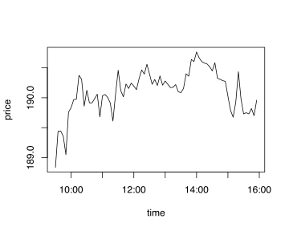

# <i class="fa fa-share-alt"></i> embedR Examples

An example is outlined below, using q to subselect some data and then passing it to R for graphical display.

```q
q)select count i by date from trade
date      | x
----------| --------
2014.01.07| 29205636
2014.01.08| 30953246
2014.01.09| 30395962
2014.01.10| 29253110
2014.01.13| 32763630
2014.01.14| 29721162
2014.01.15| 30035729
..

q)//extract mid prices in 5 minute bars
q)mids:select mid:last .5*bid+ask by time:0D00:05 xbar date+time from quotes where date=2014.01.17,sym=`IBM,time within 09:30 16:00
q)mids
time                         | mid
-----------------------------| --------
2014.01.15D09:30:00.000000000| 185.92
2014.01.15D09:35:00.000000000| 185.74
2014.01.15D09:40:00.000000000| 186.11
2014.01.15D09:45:00.000000000| 186.36
2014.01.15D09:50:00.000000000| 186.5
2014.01.15D09:55:00.000000000| 186.98
2014.01.15D10:00:00.000000000| 187.45
2014.01.15D10:05:00.000000000| 187.48  
2014.01.15D10:10:00.000000000| 187.66  
..

q)Load in R
q)\l init.q
q)//Pass the table into the R memory space
q).rk.set["mids";mids]
q)//Graph it
q).rk.exec["plot(mids$time, mids$mid, type='l', xlab='time', ylab='price')"]
```

This will produce a plot as shown in Figure 4: 

  
_Figure 4: Quote mid price plot drawn from q_

```q
q)//Save as a PDF file
q).rk.exec "pdf('test.pdf')"
q)//Close plot window
q).rk.off[]
```

If the q and R installations are running remotely from the user on a Linux machine, the graphics can be seen locally using X11 forwarding over SSH.

Aside from using R’s powerful graphics, this mechanism also allows you to call R analytics from within q.

Note that R’s timezone setting affects date transfers between R and q. For example, in the R server:

```q
q).rk.exec "Sys.setenv(TZ='GMT')"
q).rk.get "date()"
"Fri Feb  3 06:33:43 2012"
q).rk.exec "Sys.setenv(TZ='EST')"
q).rk.get "date()"
"Fri Feb  3 01:33:57 2012"
```

<i class="far fa-hand-point-right"></i>
Knowledge Base: [Timezones and Daylight Saving Time]([../../kb/timezones.md](https://code.kx.com/q/kb/timezones/))

Further examples are provided in the `examples` folder of <i class="fab fa-github"></i> [KxSystems/embedR](https://github.com/KxSystems/embedR).